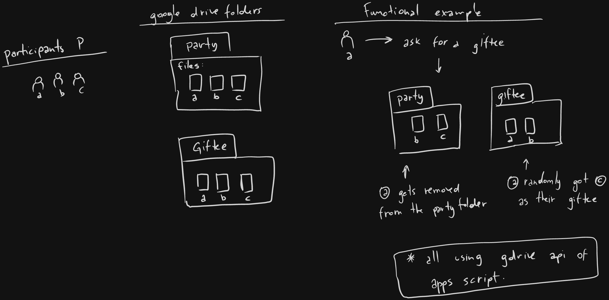

# Secret Santa

Using google drive as backend:

We abstract people (party) as files inside gdrive folders.

This project works with 2 functions
---
1. List all files from "party" folder
1. Draw a random giftee to a party member when prompted so. 

Function (2.) performs deletion of files from folder, thus is a POST operation.

- The core API functions, inside google's apps script: [drive.js](./drive.js).
- Wrapper functions to make available in any static website: [site.js](./site.js).